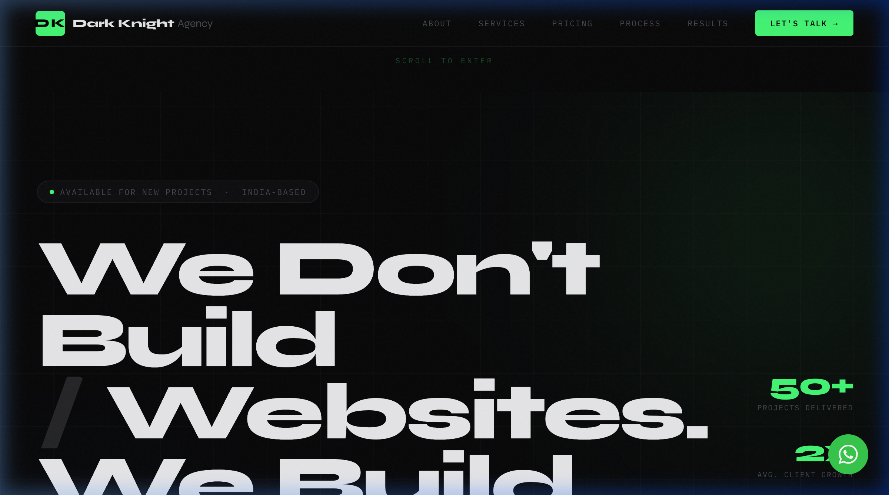
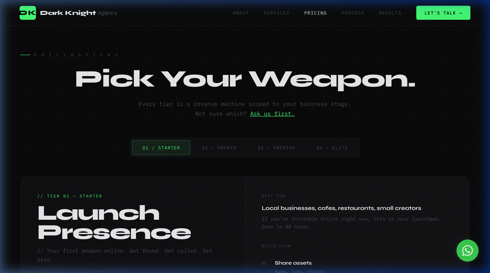

# Dark Knight Agency — We Build Growth

Dark Knight Agency builds premium websites that generate more customers, more leads, and more revenue. We don't just build websites — we build growth machines.

## 🚀 Our Philosophy
- **Revenue-First Thinking**: Every project starts with one question: *How does this make you more money?*
- **Zero Templates**: Fully custom designs tailored to your business stage.
- **Interactive Edge**: 3D elements and premium animations that set you apart.
- **Speed + Quality**: Starter sites in 1–2 days. Premium builds in under 2 weeks.

## ⚔️ Pick Your Weapon (Pricing Tiers)

1. **Tier 01: Launch Presence** (₹5K–₹10K) 
   - 1-page powerhouse in Framer. 1–2 days delivery.
2. **Tier 02: Scale Machine** (₹15K–₹30K)
   - 3–5 strategic pages in Webflow/Framer. 3–5 days delivery.
3. **Tier 03: Authority Engine** (₹40K–₹80K)
   - Custom design + API integrations. 5–10 days delivery.
4. **Tier 04: Elite Full Arsenal** (₹1L–₹3L+)
   - SaaS / Web apps in Next.js + Supabase. 10–30 days delivery.

## 🛠️ The Tech Stack
- **Design & Performance**: Framer, Webflow, Tailwind CSS, GSAP
- **Full-Stack development**: Next.js, Supabase, Custom APIs
- **Core Experience**: HTML5, Vanilla JS, Premium Animations

## ⚙️ How We Work (Our Process)
1. **Discovery**: No-fluff 30-minute call to learn your business goals.
2. **Design**: Wireframe and design approval before coding starts.
3. **Build**: Fast, transparent build with daily previews.
4. **Launch**: Performance-optimized, mobile-perfect, and live.

## 📱 Contact
Ready to grow? [Message us on WhatsApp](https://wa.me/917597562205)
